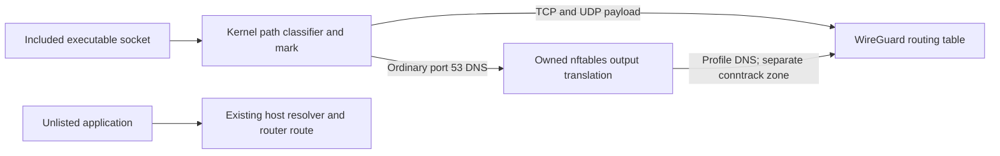

# Automatic Linux executable-path VPN and DNS inclusion

Status: implemented, with native reference-host activation and standalone
application acceptance completed September 14, 2026. See [Linux operation](../../linux.md),
[measured performance](../../linux-performance.md) and [migration](../../linux-migration.md).
The full privileged VM suite and stable-kernel positive/negative boot proofs passed.
A later focused independent review on September 14 against `b843960` recommended
the compact exact-path tier; it did not run experiments or certify the whole
implementation. The tier is now implemented and measured at `d0a40ff`.
Actual unfinished-bot deadlines remain separate from this reusable host implementation.

## Required behavior

An included native executable uses WireGuard for new IPv4 Internet
connections and the VPN profile resolver for ordinary DNS, however it is
started: shell, desktop, cron, system service or user service. A wrapper,
special launcher, UID-only rule or process-name match does not satisfy
this contract. Unlisted programs retain their normal IP and host/router
DNS path. Preserve intentional Tailscale DNS domains for unlisted clients.
Linux is include-mode only: no exclude list or host-wide VPN default mode.
Minimal added latency and compute are requirements, with an ideal target of
less than 1 ms added local p99 latency. This is not a zero-overhead or total
VPN/Internet round-trip guarantee; target-workload acceptance remains separate.

The first target is native Ubuntu 26.04 with its 7.0 kernel, systemd,
cgroup v2, kernel BTF and enabled BPF LSM. Probe required helpers and
attachment behavior; a version string alone is insufficient. Other kernel
or distribution combinations receive support only after equivalent tests.
Common native applications and Python, Node, Java, .NET and shell workloads
use this executable model through their native runtimes and network helpers.
A shared runtime selects all applications using that executable. Bot agents
can enroll their own paths later; no particular bot path is required for the
reusable implementation. See the [enrollment guide](../../linux-agents.md).

Initial scope is IPv4 TCP/UDP and ordinary UDP/TCP DNS. Block included
IPv6 and unsupported raw/packet socket access without changing host IPv6.
Helpers are included by their own executable paths, as on Windows.
Interpreted scripts identify their interpreter; listing a script alone
must be rejected rather than silently include every Python/bash program.
Already-running selected programs require restart after activation or
enrollment, including those retaining resolver mappings/cache state without
open connections. Existing or inherited connections are not newly
classified connections. Other network namespaces, different filesystem
roots, containers, sandbox integrations and arbitrary network-delegating IPC
are outside support. This is not a security boundary against hostile
applications or host administrators. Host localhost remains available;
there is no network-namespace relocation of applications.

## Decision and alternatives

The implemented backend uses a native eBPF classifier, a dedicated WireGuard
routing table and owned nftables rules. The VM comparison selected direct
kernel DNS translation over an uncached private dnsmasq forwarder. The latter
remains a test-only comparison; there is no runtime DNS service, listener,
service account or forwarder configuration.
These are separate Linux components in this repository. The Windows
components keep their existing architecture.

| Option | Assessment |
|---|---|
| eBPF LSM path classification before socket use | Selected and verified on the supported native VM; supports normal launches and synchronous matching, and requires effective BPF LSM. |
| vopono or a plain WireGuard application namespace | Good launcher-based mechanisms; fail the explicit automatic-path requirement. |
| Userspace exec monitoring plus PID/cgroup marking | Useful precedent in existing VPN clients; an asynchronous update must not be represented as protecting the first socket without a synchronous admission mechanism. |
| NFQUEUE classification of all new host flows | Could hold packets during attribution, but adds availability and connection-latency costs for unlisted applications; not selected. |

Proton's published Linux daemon provides source-level evidence for socket
marking and userspace process monitoring. It does not by itself prove this
project's required first-socket and per-application DNS contract. No
existing project examined has been established as a drop-in solution for
the complete requirement. This original source evaluation explains the
architecture choice; it is not a completed third-party security audit.

## Synchronous executable classification

The verified combined program attaches a `BPF_PROG_TYPE_LSM` program with
`BPF_LSM_CGROUP` attachment at `socket_post_create` to the root cgroup.
Resolve the current task's actual executable using
`bpf_get_task_exe_file`, `bpf_path_d_path` and `bpf_put_file`; compare its
canonical absolute path against the configured map. For included IPv4
sockets, set the reserved socket mark with the permitted
`bpf_setsockopt(SO_MARK)` helper before userspace can connect or send.

This distinction matters: the filesystem kfuncs are registered for LSM
programs, and the socket-option helper is limited to particular cgroup
LSM hooks. Do not call a pathname helper from a generic cgroup socket
program and assume the verifier will allow it. The first development
phase loaded and exercised this exact combined program before controller work.

The original fallback was an LSM `socket_create` classifier followed
synchronously by a cgroup socket-create marker with a task-local handoff.
The combined hook passed, so that fallback was unnecessary and is not
implemented. An asynchronous exec watcher was never an acceptable substitute.

Use full canonical paths, not basename, `comm`, PID-only decisions or a
static device/inode allowlist. Canonicalize symlinks at enrollment; distinct
hard-link paths remain separate. The initial identity is the canonical
executable path observed during socket creation. Renaming a still-linked
running executable changes selection for subsequent sockets; enroll the
destination before moving it if continuous VPN selection is required.
Existing sockets retain their assigned class. This initial path behavior
does not preserve a historical launch pathname after a rename.

After atomic replacement at a registered path, newly launched copies must
remain included without updating an inode map. The old unlinked running
image's new sockets return an error requiring restart. Deleted or synthetic
executable paths must never become known-unlisted through a map miss.
Check file/dentry state rather than stripping the ambiguous ` (deleted)`
text suffix; fixtures exercise real filenames with that suffix too. The
implementation resolves the executable path freshly for each classified
socket, without classification caching across sockets. Executable identity
and policy generation alone do not notice a renamed executable or ancestor
directory; an optimization must preserve those synchronous semantics. Fixtures
assert these outcomes, including rename contention and immediate first traffic.

BPF execution stays on one CPU but can be preempted by another task. The
shared per-CPU scratch buffer therefore needs explicit exclusion: disable
preemption from scratch lookup through pathname resolution and policy lookup,
then re-enable it before releasing the executable reference. This adds no
classification cache. `test_preemption.py`, included in the standard native/VM
test runner, reproduced wrong marks and resolver decisions in the old code
and passed after the fix with selected/unlisted roles reversed on one CPU.
The [performance report](../../linux-performance.md) retains that correctness
proof and the rejected initial comparison separately from valid timings.

Check host namespace and filesystem-root identity as well as the path; a
coincident pathname inside a container is not an enrolled host executable.
Unsupported contexts remain outside classification, preserving unrelated
namespace traffic; their matching path is not advertised as protected. Native
enrollment checks enforce the supported host context. A systemd private mount
namespace that preserves the host root is covered by normal-service fixtures.
Unknown, unreadable or truncated userspace paths return a socket error and a
diagnostic, never an assumed direct classification. Report this possible affected-request
failure separately from known-unlisted traffic passing normally.

Preserve unrelated socket-mark bits and inspect existing effective cgroup
attachments before choosing an owned mask. Do not override another BPF
program, systemd firewall or Tailscale mark. Global LSM guards preserve
prior deny results; cgroup LSM return semantics and composition require
separate tests. Ordinary kernel-created transport sockets are explicitly
outside application classification.

## Payload routing

Create `wgps0` in the host with no global default route. Import a validated
profile using native `wg` operations, without executing `wg-quick` hooks.
An owned mark rule selects a dedicated routing table for included application
payload and translated DNS. The WireGuard encrypted transport uses a separate
class/mark that follows the physical host route and never recurses into
its own table.

Keep a terminal unreachable/blackhole route in the VPN table, plus an
owned POSTROUTING guard that drops marked nonlocal traffic unless it leaves
through `wgps0`. Removing the interface cannot allow policy lookup to fall
through to the host default. Tests cover initial TCP SYN routing, UDP,
explicit source binds, return traffic and conntrack. Required SNAT is restricted
to owned marks and tunnel output. Arbitrary device-binding, reverse-path-filter
and MTU combinations remain outside the completed compatibility matrix.

Leave the host's local routing rule intact for localhost. Selected DNS
has an explicit interception rule before any loopback exemption. Do not
add an automatic LAN/Tailscale bypass for selected applications. Unlisted
applications retain existing LAN, Tailscale and physical routes.

This design necessarily adds scoped host policy rules and firewall chains.
It does not replace the host default route, flush firewall tables, enable
IP forwarding or introduce a universal userspace payload proxy.

## DNS selection before the shared resolver

Direct kernel translation selects included UDP/TCP port-53 traffic before
the shared host resolver. Real tests verify original response peer tuples,
separate included/unlisted responder origins and tunnel-loss blocking.
The comparison harness retains an uncached forwarder for measurements only.

Output DNAT selects the literal VPN resolver; scoped SNAT supplies the tunnel
source. Loopback-stub queries require `route_localnet` on owned `wgps0` only.
Incoming loopback-addressed traffic is limited to expected conntrack DNS replies;
host `all` and `default` settings remain unchanged. A dedicated conntrack zone
fixes the demonstrated crossover when identical UDP tuples are reused by direct
and included clients. Egress enforcement runs after routing/translation in
POSTROUTING, where the effective interface is available.

Unlisted DNS continues directly to the host's existing resolver, whose
ordinary upstream is the router after the old full tunnel is retired.
No catch-all host DNS rule, TTL changes or global cache flush is required.
App-owned DoH/DoT/DoQ uses the VPN as payload, but is not rewritten to
profile DNS. This distinction matches the existing Windows contract.

### Resolver IPC boundary

Packet classification cannot attribute DNS delegated through filesystem
Unix sockets or shared caches. Synchronous selected-process LSM guards
restrict known resolver IPC: resolved Varlink, system/user D-Bus,
Avahi and nscd sockets and shared hosts-cache files. File/socket identity
and alias handling are exercised by the native fixtures, including inherited
streams read through splice. Unrelated host processes retain access; the
implementation does not globally edit NSS.

Supported ordinary lookup uses libc's `dns` NSS path and the existing
resolver stub. Actual distro tests cover `files dns` and
`files mdns4_minimal [NOTFOUND=return] dns`, warm nscd hosts caches and Avahi
fallback. Preflight rejects unsupported NSS/cache arrangements instead of
claiming protection-ready status. If `nss-resolve` fallback is later claimed,
prove both successful fallback to marked DNS and zero host-daemon queries. Direct use of a
blocked resolver IPC API may fail; it must never silently resolve directly.

Fixtures cover late-created sockets, warm shared caches, inherited descriptors
and both UDP/TCP lookups. A guard on new file/socket access cannot revoke an
existing shared hosts-cache mapping. Require already-running selected
programs to restart after activation/enrollment before claiming their DNS
readiness, even when they have no open network connections. Actual cache
tests distinguish a freshly started selected program from a program that
mapped the cache before enrollment and its forked descendant. Fresh exec
restores DNS separation; previously mapped state requires restart. Applications
delegating networking to an existing host helper cannot be accepted merely
because their main executable is listed.
Exclude untested IPC integrations from supported enrollment.

## Configuration, control and failure behavior

Configuration consists of one private profile, a list of canonical included
executable paths, and versioned Linux routing/DNS policy. No per-app user,
argument or launcher registration is required. Profile parsing accepts
one IPv4 address, DNS server and full-tunnel peer with a literal IPv4
endpoint; validates key encodings/ports/MTU; and rejects IPv6, duplicates,
unknown fields, `Table`, `FwMark`, shell hooks and `SaveConfig`.

Use a small native libbpf loader/controller boundary and Python standard
library for strict configuration, orchestration and ownership. The
installed Python control path runs isolated from caller imports. All
privileged executables, policy maps and manifests are root-owned. Private
keys never enter command arguments, environment, logs or Git.

Pin BPF links and maps so controller exit does not remove classification.
Start in a selected-app blocking state, install table/guards, start the
VPN, probe real marked DNS and observe its handshake, then publish readiness.
Unlisted traffic is unchanged by these phases. Controller or DNS failure
retains guards; loss of VPN connectivity never selects a direct fallback.
Distinguish policy-ready, tunnel handshake and independently tested DNS/IP
health. Recovery adopts only verified owned state. A healthy daemon restart
checks host, policy, ownership and live network/DNS readiness before retaining
ready state, avoiding an unnecessary blocking activation. Failed or uncertain
checks still enter guarded recovery.

Early allocation scans do not require configured underlay routes; activation
performs transport/MTU checks later. Safe repair can recreate an owned missing
interface/preferred route while exact safety anchors remain intact. Ambiguous
births and foreign replacements are retained for inspection.

The early guard precedes ordinary network startup. Two actual VM reboots
verified a dependent early-start test application: with a working blocked
guard its first socket returned EPERM; with a deliberately failed guard the
dependent service never started. No protection claim covers execution before
the guard, and no boot-order guarantee covers applications without the required
dependency. Application agents can add `Requires=` and `After=` dependencies on the guard to their own
services without a runtime launcher requirement. Installation does not alter
arbitrary application units.

`include list` reads exact configured keys without activating or creating
runtime state; its output does not certify live enforcement. Healthy repeated
adds and absent-key removals retain readiness only after full host, journal,
configuration, kernel and network validation. Actual policy edits enter guarded
reverification and apply to new sockets. Track affected running processes at
activation/enrollment and report their restart requirement independently
of socket counts. Keep a sticky unresolved boundary when old processes were
observed: snapshots cannot prove every fork/reparent lineage has ended.
Audit initial attachment and include-add completion as well as their earlier
snapshots. Keep per-application readiness separate from installed
policy readiness. Stopping the management service retains
protection; an explicit disable/uninstall operation releases it after
reporting affected running applications. Never kill arbitrary matching
processes as cleanup. Own and track every added rule, BPF pin, interface,
service, listener and file; retain foreign/modified resources. Keep all
keys and private live observations beneath ignored local/runtime roots.

## Reference-host migration

The original September 12 planning inspection found an existing full-tunnel
VPN, catch-all VPN DNS, a repair daemon that would restart that VPN, active
collectors, and Tailscale routing/DNS exceptions. BPF LSM is compiled into the kernel but
absent from the enabled LSM list at that inspection. Refresh these live facts
before any action. TV remains unchanged by repository acceptance, with two
distinct host gates: enable the required kernel hook on a coordinated reboot,
and retire the old full-tunnel ownership during a protected-capture-aware cutover.

1. Validate the complete implementation in a disposable matching VM first.
2. Prepare an exact boot-parameter change that appends BPF LSM while
   preserving the effective existing LSM order. Verify Secure Boot and
   lockdown compatibility. Do not remove AppArmor or other protections.
   Obtain a maintenance window and test the effective post-reboot state.
3. Inventory the actual old VPN owners, repair settings and route/DNS
   hooks; prepare rollback and verify independent LAN access. Do not
   stop protected captures or inspect their outcomes.
4. Retire only the repair daemon's old VPN responsibility, preserve its
   LAN/Tailscale duties, then stop/disable the old full tunnel through its
   owner. Do not run old/new tunnels with the same provider identity
   concurrently because peer endpoint roaming can interrupt the old one.
5. Prove host public routes and DNS go to the router. Router-to-Cloudflare
   DoH requires separate router evidence; TV-to-router DNS is not that
   evidence. Preserve intentional Tailscale-specific DNS behavior.
6. Prove harmless included/unlisted executables' TCP/UDP/DNS paths and
   failures before application agents enroll their own runtimes/helpers.
   Verify collectors, LAN, Tailscale, local metrics and durable startup
   afterward; no specific bot path is required by this reusable feature.

Live migration is separate from adding this reusable Linux implementation.
The installer does not automatically change kernel boot options or disable
another VPN. Private deployment values do not enter these public docs.

## Performance acceptance

There is no zero-overhead guarantee. Root-cgroup classification adds work
to included and unlisted socket creation. Output mark checks run on packets,
policy routing adds route-lookup work, and DNS NAT can activate conntrack
for traffic beyond the matching rule. Resolver guards may add file/Unix-IPC
hook work. The comparison-only userspace DNS forwarder adds scheduling
and forwarding work; it is absent from the installed runtime.
Measure these costs separately from WireGuard encryption and the VPN's
external route. Never infer performance from kernel placement alone.

Keep established payload in the kernel, with no per-packet executable-path
lookup, userspace packet queue, process-discovery delay or per-operation
logging. Resolver guards should reject irrelevant target objects cheaply
before expensive executable lookup when object/alias correctness permits.
Do not add blanket `notrack` rules or weaken classification to win a test.

The measurement matrix separates baseline security configuration; BPF LSM
enabled without project hooks; classifier; resolver guards; complete
networking with an empty include list; then included workloads against
plain WireGuard using the same peer, destination, DNS upstream and MTU.
The initial transport comparison selected kernel DNS. The final optimization
comparison gives the old baseline the same scratch correctness fix as the
candidate. Its method, rejected runs and measured results belong in the
[performance report](../../linux-performance.md); failed classification samples
never count as successful timings. Only completed error-free comparisons
support numerical claims, and VM results do not establish target-workload
latency acceptance.

Record p50/p95/p99 latency, CPU per completed operation/packet, context
switches, memory and conntrack pressure. Cover socket churn, long-lived
TCP, small-packet UDP, DNS hits/misses/TCP fallback, file/IPC-heavy unlisted
workloads and representative bot request/deadline tails under concurrent
background load. Repeat with production instrumentation settings and on
target hardware before making a production latency claim.

Report deltas, measurement resolution and confidence bounds. The ideal target
is below 1 ms added local p99 latency with minimal compute; it does not
authorize arbitrary regressions or promise an external VPN round-trip budget.
Do not equate an inconclusive difference with equivalence. Target-workload
latency, deadline misses, CPU/memory cost and attributable loss/errors require
explicit assessment alongside routing/DNS separation before deployment.

## Acceptance gates

The implementation plan starts with three mandatory proofs: exact-path
classification and marking before first traffic; reversible UDP/TCP DNS
translation to the tunnel-only resolver; and resolver IPC/cache isolation.
The three mechanism gates passed in the native VM. Controller implementation
proceeded after the kernel/forwarder comparison; numerical TV performance
acceptance remains open rather than being inferred from microbenchmarks.
Actual deployment still requires its latency and boot acceptance.

Subsequent tests cover executable replacement, aliases, static/dynamic ELF,
independent helpers, immediate connect, same-name DNS concurrency, selected
IPv6 denial, normal loader exit, controller SIGKILL/restart, removed interfaces,
boot dependencies, conflicts, DNS outages and exact owned cleanup. The
acquisition model injects before/after each mutating prepare command and receipt
publication; ambiguous resources remain intact. It does not prove native
SIGKILL between every pin publication. Dedicated encrypted-DNS client coverage
and target-application latency remain separate from ordinary DNS and payload
mechanism tests. Keep configuration inspection, model tests, actual VM tests
and live deployment acceptance as distinct claims.

See the [implementation plan](../plans/2026-09-12-linux-include-mode.md).

## Primary sources

- [Linux VFS BPF kfunc implementation](https://github.com/torvalds/linux/blob/v7.0/fs/bpf_fs_kfuncs.c):
  executable file/path APIs and LSM-only registration.
- [Linux BPF LSM helper restrictions](https://github.com/torvalds/linux/blob/v7.0/kernel/bpf/bpf_lsm.c):
  cgroup LSM socket-option availability and supported hooks.
- [Linux socket creation](https://github.com/torvalds/linux/blob/v7.0/net/socket.c):
  post-create security checks occur before returning the socket.
- [Linux pathname reconstruction](https://github.com/torvalds/linux/blob/v7.0/fs/d_path.c):
  current executable paths and deleted/synthetic path handling.
- [Linux NAT expressions](https://github.com/torvalds/linux/blob/v7.0/net/netfilter/nft_nat.c)
  and [IPv4 output routing](https://github.com/torvalds/linux/blob/v7.0/net/ipv4/route.c):
  conntrack acquisition, NAT hook restrictions and loopback-source routing.
- [IPv4 netfilter rerouting](https://github.com/torvalds/linux/blob/v7.0/net/ipv4/netfilter.c):
  preserved source/mark during output destination changes.
- [BPF LSM documentation](https://docs.kernel.org/bpf/prog_lsm.html):
  attachment and security-hook model.
- [Proton socket monitor](https://github.com/ProtonVPN/proton-vpn-daemon/blob/stable/proton/vpn/daemon/split_tunneling/apps/socket_monitor.py)
  and [process monitor](https://github.com/ProtonVPN/proton-vpn-daemon/blob/stable/proton/vpn/daemon/split_tunneling/apps/process_monitor.py):
  existing socket-marking and asynchronous tracking mechanisms.
- [dnsmasq manual](https://thekelleys.org.uk/dnsmasq/docs/dnsmasq-man.html):
  isolated configuration, resolver forwarding and upstream interface binding.
- [ip rule manual](https://man7.org/linux/man-pages/man8/ip-rule.8.html):
  marked policy routing and terminal failure rules.
- [nss-resolve documentation](https://github.com/systemd/systemd/blob/main/man/nss-resolve.xml):
  filesystem Unix-socket resolver delegation.
- [glibc nscd host lookup](https://github.com/bminor/glibc/blob/glibc-2.42/nscd/nscd_gethst_r.c):
  lookup through a retained shared hosts mapping without a new socket.
- [vopono](https://github.com/jamesmcm/vopono) and
  [WireGuard namespaces](https://www.wireguard.com/netns/):
  the launcher-based alternatives considered.
